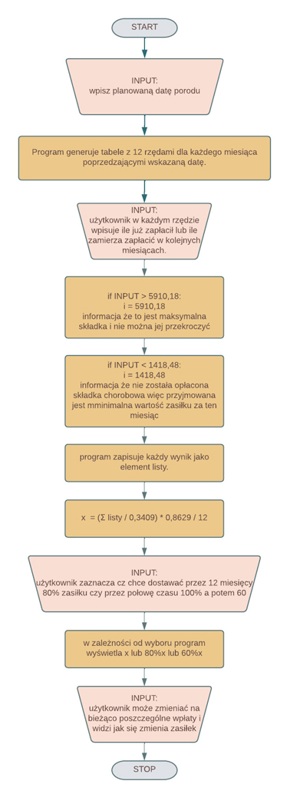

## *Maternity Allowance Calculator*

*Four years ago, before I got pregnant, I searched all over the internet to find out what I could do to get decent maternity pay while being self-employed. The internet is filled with calculators and advice for contract workers and politicians are racing to propose benefits for such mothers and make it easier to return to work. B2B workers, if they do not increase their national insurance contributions, receive a minimum benefit that does not allow them to live at their current level and makes the woman dependent on her partner's income. The only way for such women is to increase their social security contributions early enough. The question is by how much and for how many months to pay it. This is where the calculator comes in, which is adapted to various situations, including those where a person has not paid contributions for several months a year or has been in business for less than a year.*

## Kalkulator zasiłku macierzyńskiego dla osób samozatrudnionych

Cztery lata temu przed zajściem w ciąże i mając jednoosobową działalność gospodarczą, przeszukiwałam cały internet aby dowiedzieć się co zrobić aby będąc osobą samozatrudnioną dostawać godziwy zasiłek macierzyński. Internet jest wypełniony kalkulatorami i poradami dla osób zatrudnionych na umowę o pracę a politycy ścigają się w propozycjach przywileji dla takich mam i ułatwień powrotu do pracy. Osoby pracujące na B2B jeśli nie podwyższą sobie składek na ubezpieczenie społeczne, dostają minimalny zasiłek nie pozwalający prowadzić życia na dotyczczasowym poziomie i uzależniający kobietę od dochodów partnera. Dla takich osób jedynym sposobem jest odpowiedznio wczesne podniesienie skąłdek na ubezpieczenie społeczne. Pytanie tylko o ile je podnieśći przez ile miesięcy je płacić. I tu z pomocą przychodzi kalkulator który właśnie udostępniam, jest on przystosowany do różnych sytuacji, również do takich kiedy osoba przez kilka miesięcy w roku nie odprowadzała składek chorobowych lub prowadzi działalność krócej niż rok.

## Table of Contents | Spis Treści

- [*Maternity Allowance Calculator*](#maternity-allowance-calculator)
- [Kalkulator zasiłku macierzyńskiego dla osób samozatrudnionych](#kalkulator-zasiłku-macierzyńskiego-dla-osób-samozatrudnionych)
- [Table of Contents | Spis Treści](#table-of-contents--spis-treści)
- [General Information | Podstawowe Informacje](#general-information--podstawowe-informacje)
- [Technologies Used | Użyte technologie](#technologies-used--użyte-technologie)
- [Features | Funkcje](#features--funkcje)
- [Usage | Sposób Użycia](#usage--sposób-użycia)
- [Project Status | Status Projektu](#project-status--status-projektu)
- [Room for Improvement | Planowane Aktualizacje](#room-for-improvement--planowane-aktualizacje)
- [Contact | Kontakt](#contact--kontakt)
<!-- * [License](#license) -->

## General Information | Podstawowe Informacje

Wyliczenie zasiłki jest wykonane zgodnie z poniższym schematem

## Technologies Used | Użyte technologie

- Python - version 3.11.2
- Babel==2.12.1
- DateTime==5.1
- Pillow==9.5.0
- python-dateutil==2.8.2
- pytz==2023.3
- six==1.16.0
- tkcalendar==1.6.1
- ttkbootstrap==1.10.1
- zope.interface==6.0

## Features | Funkcje

List the ready features here:

## Usage | Sposób Użycia

zrzuty z ekranu
## Project Status | Status Projektu

IN PROGRESS!!!

## Room for Improvement | Planowane Aktualizacje

\

## Contact | Kontakt

Created by [@AldonaKret] - feel free to contact me!

